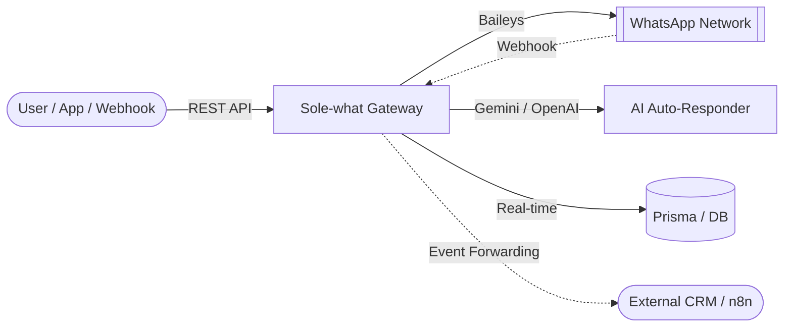

<div align="center">

# 🚀 Sole-what: Next-Gen WhatsApp & AI Automation Gateway

[](https://wa.me/)
[](https://nextjs.org/)
[](https://www.typescriptlang.org/)
[](https://www.prisma.io/)
[](https://github.com/zeeshan912989/Sole-what)

**A professional, multi-session WhatsApp Gateway, Interactive Messaging, Drip Marketing, and AI Auto-Responder System.**  
Built with **Next.js**, **React**, **Prisma**, and **Baileys** for high-performance messaging automation and real-time WhatsApp Bot services.

[Features](#-key-features) • [User Guide](docs/USER_GUIDE.md) • [API Documentation](docs/API_DOCUMENTATION.md) • [Database Setup](docs/DATABASE_SETUP.md) • [Installation](#-quick-installation)

</div>

---

## 📖 Complete Documentation

**Sole-what** comes with extensive documentation designed for both developers and users.

- **[Master Project Documentation](docs/PROJECT_DOCUMENTATION.md)**: Architecture, database schema, and logic flow.
- **[API Documentation](docs/API_DOCUMENTATION.md)**: Comprehensive reference for all **100+ endpoints**.
- **[API Quick Reference](docs/API-QUICK-REFERENCE.md)**: Instantly jumpstart your integration with ready-to-use cURL and JavaScript snippets.
- **[Environment Variables](docs/ENVIRONMENT_VARIABLES.md)**: Configuration and security guide.

---

## 🌟 Why Sole-what?

**Sole-what** transforms your WhatsApp into a fully programmable RESTful API and automated customer engagement platform. It bridges business logic with WhatsApp's global reach, supporting AI auto-replies, interactive messages, multi-step drip campaigns, and real-time webhook routing.

### 🏗️ How it Works



### 🔥 Key Features

- **📱 Multi-Session Management**: Connect and manage unlimited WhatsApp accounts simultaneously via simple QR code scans.
- **🤖 AI Auto-Responder & Fallback Mode**: Powered by Google Gemini / OpenAI. Supports **Fallback Mode** (only replies with AI when no keyword rule matches).
- **💧 Drip Marketing Sequences**: Multi-step automated follow-up sequences with customizable time delays and auto-stop on customer reply.
- **🎯 Advanced Keyword Auto-Reply**: Rule-based auto-replies with exact/contains matching, live simulator, interactive response types, and delay controls.
- **💬 Interactive WhatsApp Messages**: Send Polls, Locations, Contacts (vCards), Stickers, and Media attachments directly from chat or REST API.
- **📅 Advanced Scheduler**: Precise message planning with media support (Images, Video, Documents).
- **📢 Safe Broadcast System**: Built-in anti-ban mechanisms with randomized delays and batch execution.
- **🛡️ Granular Access Control**: Whitelist & Blacklist controls for Bot Commands and Auto Replies.
- **🔗 Webhook Management**: Real-time event forwarding for incoming messages, connection status, group updates, and participant events.
- **📘 Open API Spec & Swagger UI**: Fully interactive documentation hosted at `/swagger` and `/dashboard/api-docs`.

---

## 🚀 Quick Installation

### 1. Prerequisites
- Node.js 20+ (Node.js 22 recommended)
- MySQL Database
- Git
- PM2 (Installed globally: `npm install -g pm2`)

### 2. Setup
```bash
# Clone and install
git clone https://github.com/zeeshan912989/Sole-what.git
cd Sole-what
npm install

# Configure environment
cp .env.example .env
# Edit .env with your DATABASE_URL, AUTH_SECRET, PORT, etc.

# Push schema and generate Prisma Client
npx prisma db push
npx prisma generate

# Create SuperAdmin account
npm run make-admin admin@example.com password123
```

### 3. Run (Development)
```bash
npm run dev
```

### 4. Run (Production with PM2)
```bash
# Build the application
npm run build

# Start with PM2
pm2 start ecosystem.config.js
```

---

## 📚 API Reference Overview

**Sole-what** provides a comprehensive REST API to integrate WhatsApp Messaging into your applications. Full details in [API_DOCUMENTATION.md](docs/API_DOCUMENTATION.md).

| Method | Endpoint | Description |
| :--- | :--- | :--- |
| `POST` | `/api/messages/{sessionId}/{jid}/send` | Send text, media, or stickers |
| `POST` | `/api/messages/{sessionId}/{jid}/poll` | Send interactive WhatsApp polls |
| `POST` | `/api/messages/{sessionId}/{jid}/location` | Send location pins |
| `POST` | `/api/messages/{sessionId}/{jid}/contact` | Send vCard contact cards |
| `POST` | `/api/messages/{sessionId}/broadcast` | Scalable bulk messaging |
| `GET` | `/api/sessions/{sessionId}/ai-config` | Fetch AI Auto-Responder configuration |
| `POST` | `/api/sessions/{sessionId}/ai-config` | Update AI bot & fallback mode settings |
| `POST` | `/api/sequences/{sessionId}` | Create multi-step drip marketing campaign |

---

## 🛡️ Security
- **API Key Auth**: Secured endpoints using `X-API-Key` header.
- **RBAC**: Multi-role support (`SUPERADMIN`, `OWNER`, `STAFF`).
- **Encrypted Passwords**: All passwords hashed with bcrypt.
- **JWT Encryption**: Session tokens signed with `AUTH_SECRET`.
- **Input Validation**: Zod schemas on critical endpoints.

---

<div align="center">
  Built with ❤️ for <b>Sole-what</b>
</div>
